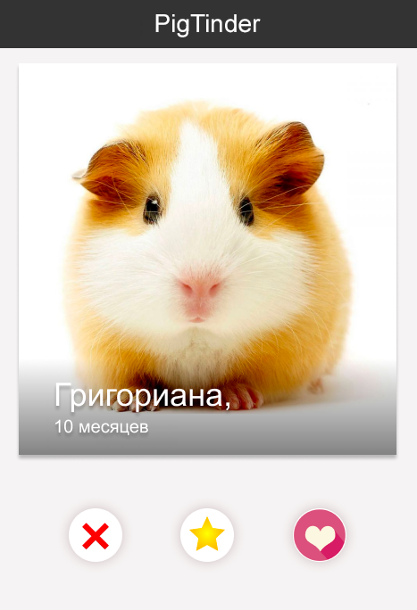

# Задача №2 "СвиноТиндер"
​
## Как отправить решение:
1. Склонируйте репозиторий ([тут](pull.md) есть описание как это сделать).
2. Напишите код в файлах ```ping-tinder/src/index.css``` ```ping-tinder/src/index.html```
3. Отправьте Pull Request. В качестве commit message пишите что изменилось.

## Основное задание
​
Представьте, что у вас дома живет чудесная морская свинка Миша. Миша в самом расцвете сил, и, кажется, пришло время обзавестись маленькими мишатами. Вы знаете, что в вашем районе есть много красивых и породистых морских свинок, которые могли бы составить чудесную пару Мише.

Чтобы найти пару Мише, вам нужно создать своё веб-приложение **PigTinder** – это приложение поиска пары для морских свинок.

Как оно должно работать:

- на экране выводится фото потенциальной пары
- нужно сверстать три кнопки – ❤, ❌ и супер-лайк – ⭐
- изображение, не вписывающееся в квадрат, должно обрезаться и выравниваться по своему центру
- после нажатия какой-либо из трёх кнопок появляется новая фотография
- должно быть много оригинальных картинок со свинками 🐽 (>= 7)
- нужно использовать полученные знания и фантазию, чтобы создать красивый и удобный интерфейс
- реализовать свои оригинальные идеи и фичи приложения, делающие его полезным и крутым



Во избежание совпадения неудачных пар, помните, что ваше приложение должно идеально отображаться на самых популярных разрешениях экрана.  Возьмем следующие размеры viewport за стандартные:

- 375 x 812
- 360 x 740
- 412 x 732

и парочку "экзотических"
  
- 540 x 720
- 280 x 653

⚠️Для того, чтобы запустить вашу страницу на мобильном устройстве в режиме разработки, можно воспользоваться одним из следующих руководств:

- [Debugging on Mobile Devices (iOS + Android)](https://support.brightcove.com/debugging-mobile-devices)
- [iOS remote debuggind with Xcode](https://dev.to/rickey_oak/ios-remote-debugging---a-how-to-guide-2onh)
- [Remote Debugging on Android Devices with Chrome Dev Tools](https://developers.google.com/web/tools/chrome-devtools/remote-debugging)

##Дополнительное задание (+10 к интерактивности)
**Задание необходимо решить с использованием нативного JavaScript**

Реализовать свайп. Он должен работать следующим образом:

- фото можно смахнуть либо влево – ❌, либо вправо – ❤
- смахивание по своему действию аналогично нажатию на соответствующую кнопку

##Рекомендации к написанию кода:
⚠️Эти пункты учитываются при проверке⚠️

- Соблюдайте семантику - важно выработать привычку называть все своими именами
- HTML-разметка и css должны быть валидными - проверьте на сайте W3C [html](https://validator.w3.org/), [css](https://jigsaw.w3.org/css-validator/)
- В CSS не используйте универсальные селекторы и по идентификаторам, если в этом нет необходимости
- В CSS не используются селекторы элементов (кроме случаев, когда это селектор охватывает 1-2 элемента, например, body или html). Предпочтительны селекторы классов
- Старайтесь не дублировать название одного и того же класса, а селекторы с одинаковым набором правил группируются в один через запятую
- Не используйте !important и инлайн-стили, если в этом нет необходимости, а если есть причины - опишите в комментариях в коде
- Решение должно корректно отображаться и работать в последних версиях современных браузеров (Chrome, Firefox, Safari, YandexBrowser)
- Пишите комментарии в коде, почему приходится нарушать рекомендации

